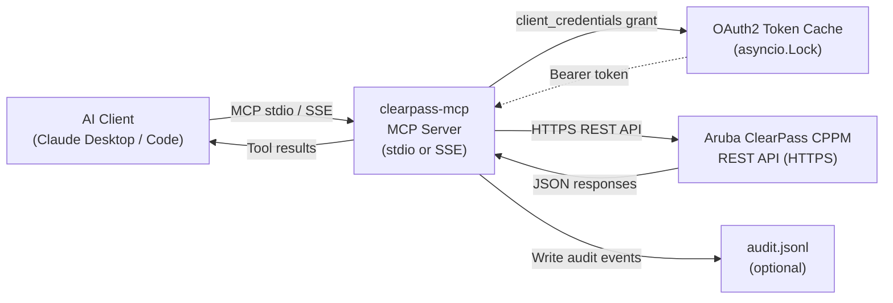

# 🛡️ Aruba ClearPass MCP Server

[](https://github.com/Nandi-Pura/Aruba-Clearpass-MCP-Server/actions/workflows/ci.yml)
[](https://www.python.org/downloads/)
[](LICENSE)
[](https://modelcontextprotocol.io)
[](https://devhub.arubanetworks.com/code-exchange)

> **Community-maintained MCP server for Aruba ClearPass Policy Manager.**
> Not an official HPE / Aruba Networks product. MIT licensed. Use at your own risk.

Enable AI assistants (Claude, Cursor, Continue.dev, and any MCP-compatible client) to query
and manage your ClearPass Policy Manager using natural language — look up endpoints by MAC,
investigate active sessions, provision guest accounts, run health checks, and more.

---

## Architecture



**Key technical properties:**
- Single persistent `httpx.AsyncClient` (connection pooling, no per-request overhead)
- `asyncio.Lock` prevents thundering-herd duplicate token refreshes
- Automatic 401 → token refresh → retry cycle
- Tenacity retry with exponential backoff for 5xx / timeouts (3 attempts, 1–10 s)
- Paginated list endpoints via `_links.next` following (configurable `max_pages`)
- Structured JSON audit log for all write operations (redacts secrets automatically)

---

## Quick Start

### Install from source (recommended)

```bash
git clone https://github.com/Nandi-Pura/Aruba-Clearpass-MCP-Server.git
cd Aruba-Clearpass-MCP-Server
pip install -e .
clearpass-mcp --help
```

### Run without cloning (via `uvx`)

```bash
# Requires Python 3.10+ and uv installed
uvx --from git+https://github.com/Nandi-Pura/Aruba-Clearpass-MCP-Server clearpass-mcp --check
```

> **Note:** `uvx clearpass-mcp` (without `--from git+...`) will be available once this package
> is published to PyPI. Until then, use the `git+https` form above or install from source.

### Configuration

Copy `.env.example` to `.env` and fill in your values:

```bash
cp .env.example .env
```

```bash
# Required
CLEARPASS_HOST=https://clearpass.yourdomain.com
CLEARPASS_CLIENT_ID=your_api_client_id
CLEARPASS_CLIENT_SECRET=your_api_client_secret

# Optional
CLEARPASS_VERIFY_SSL=true          # false only for lab self-signed certs
CLEARPASS_READ_ONLY=false          # true = monitoring-only, blocks all writes
CLEARPASS_LOG_LEVEL=INFO
CLEARPASS_AUDIT_LOG_PATH=          # e.g. /var/log/clearpass-mcp/audit.jsonl
CLEARPASS_MAX_PAGES=20
```

> **ClearPass API client setup:**
> In the ClearPass UI → *Administration → API Services → API Clients*, create a new client
> with *Grant Type: client_credentials* and assign an Operator Profile with appropriate
> permissions (read-only profile for monitoring, API Administrator for full access).

### Validate your configuration

```bash
clearpass-mcp --check
```

Exit codes: `0` = success, `1` = config error, `2` = OAuth2 error.

---

## Client Integration

### Claude Desktop

Add to `%APPDATA%\Claude\claude_desktop_config.json` (Windows) or
`~/Library/Application Support/Claude/claude_desktop_config.json` (macOS).

**From source** (`pip install -e .` must have been run first — this puts `clearpass-mcp` on PATH inside the venv):

```json
{
  "mcpServers": {
    "clearpass": {
      "command": "clearpass-mcp",
      "env": {
        "CLEARPASS_HOST": "https://clearpass.yourdomain.com",
        "CLEARPASS_CLIENT_ID": "your_client_id",
        "CLEARPASS_CLIENT_SECRET": "your_client_secret",
        "CLEARPASS_VERIFY_SSL": "true"
      }
    }
  }
}
```

**Alternatively, reference the Python module directly** (no PATH requirement):

```json
{
  "mcpServers": {
    "clearpass": {
      "command": "/path/to/venv/python",
      "args": ["-m", "clearpass_mcp"],
      "env": {
        "CLEARPASS_HOST": "https://clearpass.yourdomain.com",
        "CLEARPASS_CLIENT_ID": "your_client_id",
        "CLEARPASS_CLIENT_SECRET": "your_client_secret"
      }
    }
  }
}
```

### SSE Transport (remote / multi-user)

```bash
clearpass-mcp --transport sse --host 0.0.0.0 --port 8000
```

Or with Docker:

```bash
docker run -p 8000:8000 \
  -e CLEARPASS_HOST=https://clearpass.yourdomain.com \
  -e CLEARPASS_CLIENT_ID=your_client_id \
  -e CLEARPASS_CLIENT_SECRET=your_client_secret \
  clearpass-mcp --transport sse --host 0.0.0.0 --port 8000
```

---

## Tool Reference

### Typed Tools (Phase 4 — recommended for common workflows)

| Tool | Category | R/W | `confirm` required | Description |
|------|----------|-----|--------------------|-------------|
| `find_endpoint_by_mac` | Identities | R | — | Look up endpoint by MAC address. Normalises colons/hyphens/bare hex automatically. |
| `get_endpoint_insight` | Logs & Audit | R | — | Retrieve ClearPass Insight analytics for a MAC or IP address. |
| `list_active_sessions` | Session Control | R | — | Paginated list of active RADIUS/802.1X sessions, with optional filter dict. |
| `disconnect_session` | Session Control | W | ✅ | Disconnect a single active session. Requires `confirm=True`. Supports `dry_run`. |
| `bulk_coa` | Session Control | W | ✅ | Send a Change-of-Authorization to sessions matching a filter. Supports `dry_run`. |
| `create_guest_account` | Identities | W | — | Create a time-limited guest account. Auto-calculates `expire_time`. Supports `dry_run`. |
| `get_server_health` | Server Config | R | — | Aggregated cluster health: versions, node list, FIPS mode. |
| `search_audit_records` | Logs & Audit | R | — | Paginated audit record search with time range and optional category filter. |

### Generic Proxy Tools (escape hatch — any endpoint)

| Tool | Method | Description |
|------|--------|-------------|
| `clearpass_get` | GET | Query any ClearPass endpoint with optional params |
| `clearpass_post` | POST | Create resources or trigger actions. Supports `dry_run`. |
| `clearpass_patch` | PATCH | Partial update any resource. Supports `dry_run`. |
| `clearpass_put` | PUT | Full resource replacement. Supports `dry_run`. |
| `clearpass_delete` | DELETE | Delete any resource. Requires `confirm=True`. Supports `dry_run`. |
| `clearpass_list_apis` | — | Browse the static endpoint catalog with optional category filter. |

> **Tip:** Use `clearpass_list_apis` first to discover the available endpoints for a given
> category (e.g. `"SessionControl"`, `"PolicyElements"`, `"GuestActions"`).

---

## MCP Resources & Prompts

### Resource

| URI | Description |
|-----|-------------|
| `clearpass://api-catalog` | Full endpoint catalog (JSON) — load for endpoint discovery without a tool call |

### Guided Prompts

| Prompt | Parameters | Use case |
|--------|-----------|----------|
| `investigate_device_by_mac` | `mac_address` | Multi-step device investigation (endpoint + sessions + Insight) |
| `onboard_guest_account` | `visitor_name`, `contact_email`, `valid_hours` | Guided guest provisioning with dry-run step |
| `quarantine_endpoint` | `mac_address` | Investigate → confirm → disconnect suspicious device |
| `daily_cluster_health_check` | — | Health, licenses, audit summary, and system events |

---

## Security

### Read-Only Mode

Set `CLEARPASS_READ_ONLY=true` to prevent all write operations at the server level.
Recommended for monitoring integrations where no changes should be made.

```bash
CLEARPASS_READ_ONLY=true clearpass-mcp
```

### Dry-Run Mode

Every write tool supports `dry_run=True`. When enabled:
- The intended HTTP request is logged (with body redacted) to the audit log
- A preview dict is returned showing exactly what *would* have been sent
- No request is made to ClearPass

Always use `dry_run=True` first when working with unfamiliar tools or large datasets.

### Audit Logging

All write operations (POST/PATCH/PUT/DELETE) emit a structured JSON line to stderr
and optionally to a file:

```json
{
  "timestamp": "2024-01-15T09:30:00+00:00",
  "tool": "create_guest_account",
  "method": "POST",
  "path": "/guest",
  "body": {"username": "alice@example.com", "password": "[REDACTED]", "role_id": 5},
  "dry_run": false,
  "outcome": "success",
  "status_code": 201
}
```

Keys containing `secret`, `password`, `token`, `key`, or `credential` are automatically
redacted.

Enable file logging:

```bash
CLEARPASS_AUDIT_LOG_PATH=/var/log/clearpass-mcp/audit.jsonl clearpass-mcp
```

### TLS / SSL

Always keep `CLEARPASS_VERIFY_SSL=true` in production. Disabling certificate verification
exposes you to man-in-the-middle attacks. Only disable in isolated lab environments.

### Principle of Least Privilege

Create a dedicated API client in ClearPass with an Operator Profile that grants only the
permissions your use case requires. Avoid using `super_admin` API clients.

---

## Relation to `pyclearpass`

This server is complementary to, not a replacement for, the official
[`pyclearpass`](https://github.com/aruba/pyclearpass) SDK maintained by Aruba:

| | `clearpass-mcp` | `pyclearpass` |
|--|--|--|
| **Purpose** | AI-assistant integration via MCP | General Python scripting / automation |
| **Interface** | Natural language → MCP tools | Python function calls |
| **Auth** | OAuth2 `client_credentials` | OAuth2 (multiple grant types) |
| **Status** | Community-maintained (MIT) | Official Aruba SDK (Apache 2.0) |

For scripting and automation outside an AI context, use `pyclearpass`.
For integrating ClearPass into Claude, Cursor, or other MCP clients, use this server.

---

## Development

See [CONTRIBUTING.md](CONTRIBUTING.md) for setup, testing, and PR guidelines.

```bash
# Install with dev dependencies
pip install -e ".[dev]"

# Lint
ruff check .

# Type check
mypy src

# Tests
pytest

# Validate config against a real ClearPass instance
clearpass-mcp --check
```

---

## Acknowledgements

- [Aruba ClearPass REST API Guide](https://developer.arubanetworks.com/aruba-cppm/reference)
  — the authoritative source for all endpoint paths, request/response schemas, and
  authentication flows documented in this server.
- [`pyclearpass`](https://github.com/aruba/pyclearpass) — the official Aruba Python SDK
  for ClearPass, which served as a reference for API structure and endpoint organisation.
- The [MCP Python SDK](https://github.com/modelcontextprotocol/python-sdk) — the upstream
  `FastMCP` framework that powers this server's tool and resource registration.
- The broader Aruba MCP community (`aruba-central-mcp`, `central-mcp-server`,
  `aruba-cx-mcp-server`) for establishing the patterns this project follows.

---

## Disclaimer

This is a community project and is **not** affiliated with, endorsed by, or supported by
Hewlett Packard Enterprise (HPE) or Aruba Networks. It is provided "as is" under the MIT
license. Always test in a non-production environment before deploying against a live
ClearPass cluster.

---

## License

[MIT](LICENSE) © 2024 Nandi-Pura
